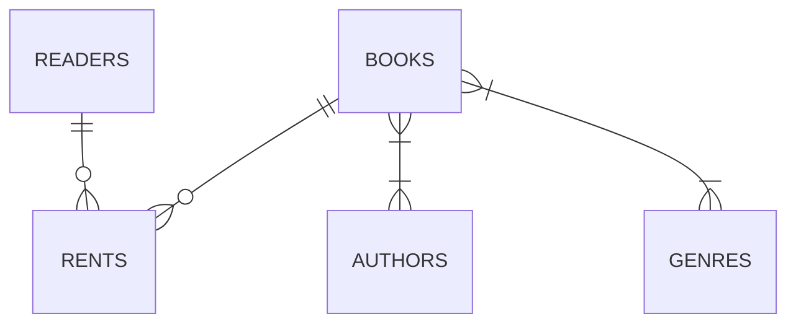
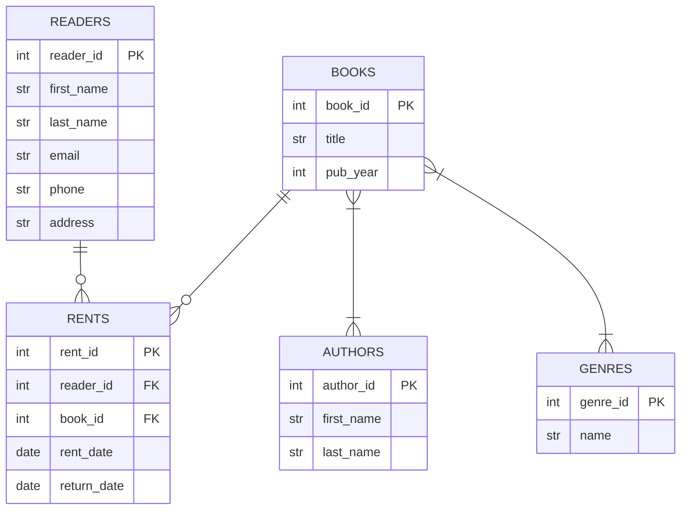

# Проектирование базы данных для библиотеки

## Сущности и связи
Начнем с определения основных сущностей и связей между ними:

- `Reader` - читатель
- `Book` - книга
- `Author` - автор
- `Genre` - жанр
- `Rent` - аренда



## Сущности

### Reader
- reader_id INT - идентификатор читателя
- first_name VARCHAR(50) - имя читателя
- last_name VARCHAR(50) - фамилия читателя
- email VARCHAR(100) - email читателя
- phone VARCHAR(20) - телефон читателя
- address VARCHAR(500) - адрес читателя

### Book
- book_id INT - первичный ключ книги
- title VARCHAR(255) - название книги
- pub_year INT - год издания

### Author
- author_id INT - первичный ключ автора
- first_name VARCHAR(50) - имя автора
- last_name VARCHAR(50) - фамилия автора

### Genre
- genre_id INT - первичный ключ жанра
- name VARCHAR(100) - название жанра

## Связи

### Rent (Book_Reader)
- rent_id INT - первичный ключ аренды
- reader_id INT - идентификатор читателя
- book_id INT - идентификатор книги
- rent_date DATE - дата аренды
- return_date DATE - дата возврата

### Book_Author
- book_id INT - идентификатор книги
- author_id INT - идентификатор автора

### Book_Genre
- book_id INT - идентификатор книги
- genre_id INT - идентификатор жанра



## SQL для создания таблиц

```sql
CREATE TABLE readers (
    reader_id INT PRIMARY KEY AUTO_INCREMENT,
    first_name VARCHAR(50) NOT NULL,
    last_name VARCHAR(50) NOT NULL,
    email VARCHAR(100) UNIQUE,
    phone VARCHAR(20),
    address VARCHAR(500) NOT NULL
) ENGINE=InnoDB DEFAULT CHARSET=utf8mb4;

CREATE TABLE books (
    book_id INT PRIMARY KEY AUTO_INCREMENT,
    title VARCHAR(255) NOT NULL,
    pub_year SMALLINT NOT NULL
) ENGINE=InnoDB DEFAULT CHARSET=utf8mb4;

CREATE TABLE authors (
    author_id INT PRIMARY KEY AUTO_INCREMENT,
    first_name VARCHAR(50) NOT NULL,
    last_name VARCHAR(50) NOT NULL
) ENGINE=InnoDB DEFAULT CHARSET=utf8mb4;

CREATE TABLE genres (
    genre_id INT PRIMARY KEY AUTO_INCREMENT,
    name VARCHAR(100) NOT NULL UNIQUE
) ENGINE=InnoDB DEFAULT CHARSET=utf8mb4;

CREATE TABLE rents (
    rent_id INT PRIMARY KEY AUTO_INCREMENT,
    reader_id INT NOT NULL,
    book_id INT NOT NULL,
    rent_date DATE NOT NULL,
    return_date DATE,
    FOREIGN KEY (reader_id) REFERENCES readers(reader_id) ON DELETE RESTRICT,
    FOREIGN KEY (book_id) REFERENCES books(book_id) ON DELETE RESTRICT
) ENGINE=InnoDB DEFAULT CHARSET=utf8mb4;

CREATE TABLE book_authors (
    book_id INT NOT NULL,
    author_id INT NOT NULL,
    FOREIGN KEY (book_id) REFERENCES books(book_id) ON DELETE CASCADE,
    FOREIGN KEY (author_id) REFERENCES authors(author_id) ON DELETE CASCADE,
    PRIMARY KEY (book_id, author_id)
) ENGINE=InnoDB DEFAULT CHARSET=utf8mb4;

CREATE TABLE book_genres (
    book_id INT NOT NULL,
    genre_id INT NOT NULL,
    FOREIGN KEY (book_id) REFERENCES books(book_id) ON DELETE CASCADE,
    FOREIGN KEY (genre_id) REFERENCES genres(genre_id) ON DELETE CASCADE,
    PRIMARY KEY (book_id, genre_id)
) ENGINE=InnoDB DEFAULT CHARSET=utf8mb4;
```

## SQL для заполнения таблиц

## SQL для запросов