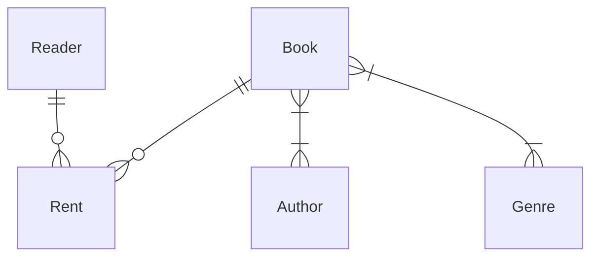

# Проектирование базы данных для библиотеки

## Сущности и связи
Начнем с определения основных сущностей и связей между ними:

- `Reader` - читатель
- `Book` - книга
- `Author` - автор
- `Genre` - жанр
- `Rent` - аренда

