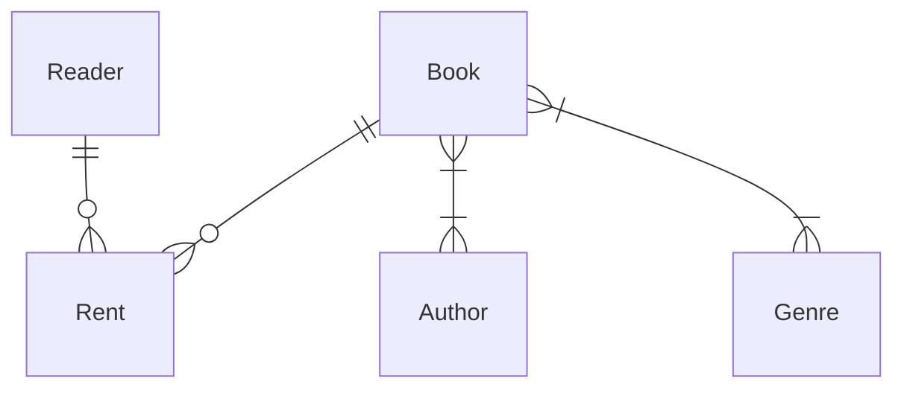
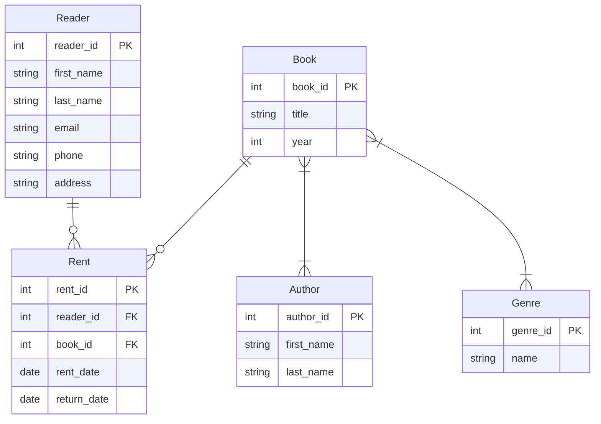

# Проектирование базы данных для библиотеки

## Сущности и связи
Начнем с определения основных сущностей и связей между ними:

- `Reader` - читатель
- `Book` - книга
- `Author` - автор
- `Genre` - жанр
- `Rent` - аренда

## Сущности

### Reader
- reader_id INT - идентификатор читателя
- first_name VARCHAR(50) - имя читателя
- last_name VARCHAR(50) - фамилия читателя
- email VARCHAR(100) - email читателя
- phone VARCHAR(20) - телефон читателя
- address VARCHAR(255) - адрес читателя

### Book
- book_id INT - первичный ключ книги
- title VARCHAR(100) - название книги
- year INT - год издания

### Author
- author_id INT - первичный ключ автора
- first_name VARCHAR(50) - имя автора
- last_name VARCHAR(50) - фамилия автора

### Genre
- genre_id INT - первичный ключ жанра
- name VARCHAR(100) - название жанра

## Связи

### Rent (Book_Reader)
- rent_id INT - первичный ключ аренды
- reader_id INT - идентификатор читателя
- book_id INT - идентификатор книги
- rent_date DATE - дата аренды
- return_date DATE - дата возврата

### Book_Author
- book_id INT - идентификатор книги
- author_id INT - идентификатор автора

### Book_Genre
- book_id INT - идентификатор книги
- genre_id INT - идентификатор жанра

