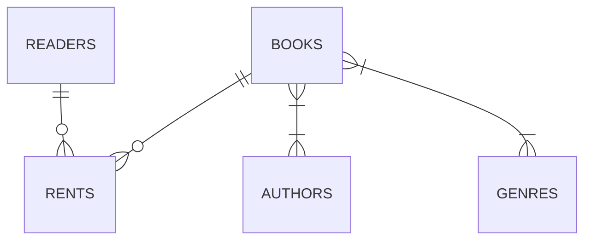
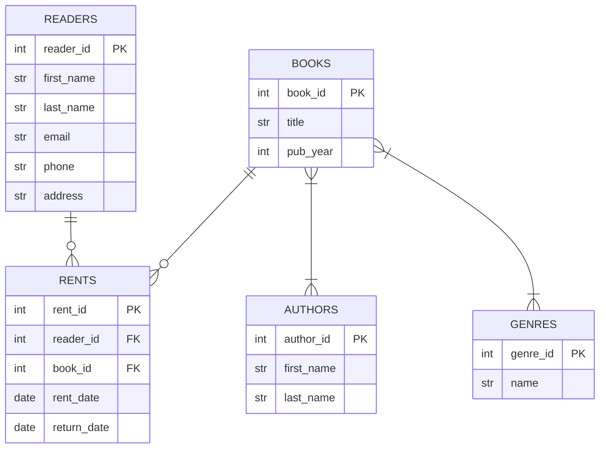

# Проектирование базы данных для библиотеки

## Сущности и связи
Начнем с определения основных сущностей и связей между ними:

- `Reader` - читатель
- `Book` - книга
- `Author` - автор
- `Genre` - жанр
- `Rent` - аренда



## Сущности

### Reader
- reader_id INT - идентификатор читателя
- first_name VARCHAR(50) - имя читателя
- last_name VARCHAR(50) - фамилия читателя
- email VARCHAR(100) - email читателя
- phone VARCHAR(20) - телефон читателя
- address VARCHAR(500) - адрес читателя

### Book
- book_id INT - первичный ключ книги
- title VARCHAR(255) - название книги
- pub_year INT - год издания

### Author
- author_id INT - первичный ключ автора
- first_name VARCHAR(50) - имя автора
- last_name VARCHAR(50) - фамилия автора

### Genre
- genre_id INT - первичный ключ жанра
- name VARCHAR(100) - название жанра

## Связи

### Rent (Book_Reader)
- rent_id INT - первичный ключ аренды
- reader_id INT - идентификатор читателя
- book_id INT - идентификатор книги
- rent_date DATE - дата аренды
- return_date DATE - дата возврата

### Book_Author
- book_id INT - идентификатор книги
- author_id INT - идентификатор автора

### Book_Genre
- book_id INT - идентификатор книги
- genre_id INT - идентификатор жанра



## SQL для создания таблиц

```sql
CREATE TABLE readers (
    reader_id INT PRIMARY KEY AUTO_INCREMENT,
    first_name VARCHAR(50) NOT NULL,
    last_name VARCHAR(50) NOT NULL,
    email VARCHAR(100) UNIQUE,
    phone VARCHAR(20),
    address VARCHAR(500) NOT NULL
) ENGINE=InnoDB DEFAULT CHARSET=utf8mb4;

CREATE TABLE books (
    book_id INT PRIMARY KEY AUTO_INCREMENT,
    title VARCHAR(255) NOT NULL,
    pub_year SMALLINT NOT NULL
) ENGINE=InnoDB DEFAULT CHARSET=utf8mb4;

CREATE TABLE authors (
    author_id INT PRIMARY KEY AUTO_INCREMENT,
    first_name VARCHAR(50) NOT NULL,
    last_name VARCHAR(50) NOT NULL
) ENGINE=InnoDB DEFAULT CHARSET=utf8mb4;

CREATE TABLE genres (
    genre_id INT PRIMARY KEY AUTO_INCREMENT,
    name VARCHAR(100) NOT NULL UNIQUE
) ENGINE=InnoDB DEFAULT CHARSET=utf8mb4;

CREATE TABLE rents (
    rent_id INT PRIMARY KEY AUTO_INCREMENT,
    reader_id INT NOT NULL,
    book_id INT NOT NULL,
    rent_date DATE NOT NULL,
    return_date DATE,
    FOREIGN KEY (reader_id) REFERENCES readers(reader_id) ON DELETE RESTRICT,
    FOREIGN KEY (book_id) REFERENCES books(book_id) ON DELETE RESTRICT
) ENGINE=InnoDB DEFAULT CHARSET=utf8mb4;

CREATE TABLE book_authors (
    book_id INT NOT NULL,
    author_id INT NOT NULL,
    FOREIGN KEY (book_id) REFERENCES books(book_id) ON DELETE CASCADE,
    FOREIGN KEY (author_id) REFERENCES authors(author_id) ON DELETE CASCADE,
    PRIMARY KEY (book_id, author_id)
) ENGINE=InnoDB DEFAULT CHARSET=utf8mb4;

CREATE TABLE book_genres (
    book_id INT NOT NULL,
    genre_id INT NOT NULL,
    FOREIGN KEY (book_id) REFERENCES books(book_id) ON DELETE CASCADE,
    FOREIGN KEY (genre_id) REFERENCES genres(genre_id) ON DELETE CASCADE,
    PRIMARY KEY (book_id, genre_id)
) ENGINE=InnoDB DEFAULT CHARSET=utf8mb4;
```

## SQL для заполнения таблиц

### Добавление автора

```sql
INSERT INTO authors (first_name, last_name) VALUES
    ("Лев", "Толстой"),
    ("Михаил", "Булгаков"),
    ("Сергей", "Довлатов"),
    ("Владимир", "Набоков"),
    ("Эрнест", "Хемингуэй"),
    ("Джон", "Стейнбек"),
    ("Курт", "Воннегут");
```

### Добавление жанра
```sql
INSERT INTO genres (name) VALUES
    ("Роман"),
    ("Сатира"),
    ("Фантастика"),
    ("Историческая проза"),
    ("Драма");
```

### Добавление книг

```sql
INSERT INTO books (title, pub_year) VALUES
    ("Война и мир", 1869),
    ("Анна Каренина", 1877),
    ("Мастер и Маргарита", 1967),
    ("Собачье сердце", 1925),
    ("Заповедник", 1983),
    ("Компромисс", 1981),
    ("Лолита", 1955),
    ("Защита Лужина", 1930),
    ("Старик и море", 1952),
    ("По ком звонит колокол", 1940),
    ("Гроздья гнева", 1939),
    ("О мышах и людях", 1937),
    ("Бойня номер пять", 1969),
    ("Колыбель для кошки", 1963);
```

### Связь книг с авторами

```sql
INSERT INTO book_authors (book_id, author_id) VALUES
    (1, 1), (2, 1),   -- Толстой
    (3, 2), (4, 2),   -- Булгаков
    (5, 3), (6, 3),   -- Довлатов
    (7, 4), (8, 4),   -- Набоков
    (9, 5), (10, 5),  -- Хемингуэй
    (11, 6), (12, 6), -- Стейнбек
    (13, 7), (14, 7); -- Воннегут
```

### Связь книг с жанрами

```sql
-- Жанры: 1-Роман, 2-Сатира, 3-Фантастика, 4-Историческая проза, 5-Драма
INSERT INTO book_genres (book_id, genre_id) VALUES
    (1, 1), (1, 4),          -- Война и мир: роман, историческая проза
    (2, 1), (2, 5),          -- Анна Каренина: роман, драма
    (3, 1), (3, 2), (3, 3),  -- Мастер и Маргарита: роман, сатира, фантастика
    (4, 2), (4, 3),          -- Собачье сердце: сатира, фантастика
    (5, 1), (5, 2),          -- Заповедник: роман, сатира
    (6, 2),                  -- Компромисс: сатира
    (7, 1), (7, 5),          -- Лолита: роман, драма
    (8, 1), (8, 5),          -- Защита Лужина: роман, драма
    (9, 1), (9, 5),          -- Старик и море: роман, драма
    (10, 1), (10, 4),        -- По ком звонит колокол: роман, историческая проза
    (11, 1), (11, 5),        -- Гроздья гнева: роман, драма
    (12, 1), (12, 5),        -- О мышах и людях: роман, драма
    (13, 1), (13, 2), (13, 3), -- Бойня номер пять: роман, сатира, фантастика
    (14, 1), (14, 2), (14, 3); -- Колыбель для кошки: роман, сатира, фантастика
```

### Добавление читателей

```sql
INSERT INTO readers (first_name, last_name, email, phone, address) VALUES
    ("Иван", "Петров", "petrov@mail.ru", "+79161234567", "ул. Ленина, 10"),
    ("Мария", "Сидорова", NULL, "+79037654321", "ул. Пушкина, 25"),
    ("Алексей", "Козлов", "kozlov@gmail.com", NULL, "ул. Гагарина, 5"),
    ("Елена", "Новикова", NULL, NULL, "ул. Мира, 42"),
    ("Дмитрий", "Морозов", "morozov@yandex.ru", "+79037778899", "ул. Чехова, 18");
```

### Аренда книги

```sql
INSERT INTO rents (reader_id, book_id, rent_date) VALUES
    (1, 3, "2025-12-01"); -- Петров берёт "Мастер и Маргарита"
```

### Возврат книги

```sql
UPDATE rents SET return_date = "2025-12-10" WHERE book_id = 3 AND reader_id = 1 AND return_date IS NULL;
```

## SQL для запросов